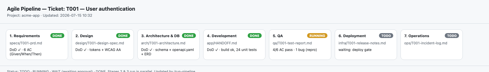

# Agile Pipeline Kit

[](./LICENSE)
[](https://github.com/hungkiethutech/agile-pipeline-kit/releases)
[](./CONTRIBUTING.md)
[](https://claude.com/claude-code)

> A free, Claude-Code-native Agile software delivery pipeline: **8 independent
> agent "teams"** that hand off work by contract — like outsourcing to real teams.

Runs entirely inside [Claude Code](https://claude.com/claude-code) on your
subscription — **no paid API, no server, no CI cost**.

🇻🇳 Tiếng Việt: see [README.vi.md](./README.vi.md).


*The `status/STATUS.html` board, updated by `/run-pipeline` as a ticket moves through the 8 stages.*

## ⚡ Quick setup (one command)
```bash
# 1) Clone the kit once
git clone https://github.com/hungkiethutech/agile-pipeline-kit.git ~/.agile-kit

# 2) Scaffold any new project with a single command
bash ~/.agile-kit/init.sh ~/path/to/new-project
```
`init.sh` creates the folder structure and copies the 8 agents, the orchestrator
command, config, catalog, templates, a status board, and a sample ticket into your
project. Then edit `pipeline.config.yml`, edit `tickets/T001.md`, open Claude Code
in the project and run `/run-pipeline T001`.

(Manual step-by-step: see [APPLY.md](./APPLY.md).)

## Philosophy
- **Independent like external teams** — each stage is a separate subagent with its
  own isolated context; it only receives the previous stage's *handoff artifact*,
  never the internal reasoning.
- **Contract-based handoff** — a stage starts only when the prior artifact meets its
  **Definition of Done (DoD)**.
- **Black-box QA** — the test team gets only the running app + acceptance criteria,
  and is *not allowed* to read the developer's source. It tests like a real end user,
  so bugs found are real and unbiased.
- **Dev builds to contract** — implements against the architect's `schema` +
  `openapi.yaml`, never inventing its own.

## The 8 stages
| # | Stage | Folder | Subagent |
|---|---|---|---|
| 1 | Requirements (BA) | `specs/` | `ap-ba-agent` |
| 2 | UX/UI Design | `design/` | `ap-design-agent` |
| 3 | Architecture & DB | `arch/` | `ap-arch-agent` |
| 4 | Development (BE+FE) | `app/` | `ap-dev-agent` |
| 5 | QA (black-box) | `qa/` | `ap-qa-agent` |
| 6 | Security / Pentest (OWASP Top 10:2025) | `security/` | `ap-security-agent` |
| 7 | Deployment (DevOps) | `infra/` | `ap-devops-agent` |
| 8 | Operations (SRE) | `ops/` | `ap-ops-agent` |

Stages 2 and 3 run **in parallel** (both depend only on the PRD from stage 1),
then both feed stage 4.

## Pluggable engines
Each stage can plug in a **skill** and/or a **popular GitHub repo** as its engine,
chosen per run in `pipeline.config.yml` (see [`catalog/engines.md`](./catalog/engines.md)).
Examples: `github/spec-kit` for requirements, a taste/design skill for UX,
`prisma/prisma` + OpenAPI for architecture, `microsoft/playwright` for QA,
`upptime/upptime` for free monitoring.

## Why this kit / when to use it
Most AI-coding tools make **one** agent code well. This kit instead runs a **pipeline of
independent specialist teams** that hand off by contract — so you get separation of duties:
an independent black-box QA team, a dedicated security/pentest gate, and a Dev team that
builds strictly to the architect's schema + API contract. Use it when you want your AI
delivery to feel like an outsourced, standards-driven software team rather than a single
"do-everything" agent.

| | **Agile Pipeline Kit** | Single coding agent | spec-kit | Superpowers |
|---|---|---|---|---|
| Model | 8 independent teams, contract handoff | one agent | spec→plan→tasks (one agent) | skills library + TDD |
| Independent black-box QA | ✅ | ❌ | ❌ | ❌ |
| Security / pentest gate (OWASP Top 10:2025) | ✅ | ❌ | ❌ | partial |
| Pluggable engine per stage (skill or GitHub repo) | ✅ | ❌ | ❌ | ❌ |
| Runs free in Claude Code (no paid API) | ✅ | ✅ | ✅ | ✅ |

Complementary, not competing: you can plug `github/spec-kit` into stage 1 and Superpowers
skills into stages 4–5 via `pipeline.config.yml`.

See a full illustrative run in [`examples/`](./examples/README.md).

## Contents
```
init.sh                     one-command scaffolder
pipeline.config.yml         per-run engine choices
catalog/engines.md          engine catalog per stage
agents/                     7 subagent definitions
templates/artifacts.md      artifact templates + DoD checklists
commands/run-pipeline.md    orchestrator command
status/STATUS.template.html  Kanban status board (open in a browser)
APPLY.md                    manual setup guide
```

## How it runs
1. Configure engines in `pipeline.config.yml`.
2. Create a ticket (a markdown file in `tickets/`).
3. In Claude Code, run `/run-pipeline <ticket>`.
4. The orchestrator moves the ticket through the 8 stages, pausing at 2 human gates
   (approve requirements, approve before deploy).
5. Open `status/STATUS.html` in a browser to track progress.

## Status & roadmap
- **v0.1.0 (current):** framework is complete and usable; docs, agents, and templates
  are in English (Vietnamese README available at [README.vi.md](./README.vi.md)).
- Next: register with `vc-setup` for one-command scaffolding; add worked example runs.
- Contributions welcome — see [CONTRIBUTING.md](./CONTRIBUTING.md).

## License
[MIT](./LICENSE) © 2026 Dang Hung Kiet
